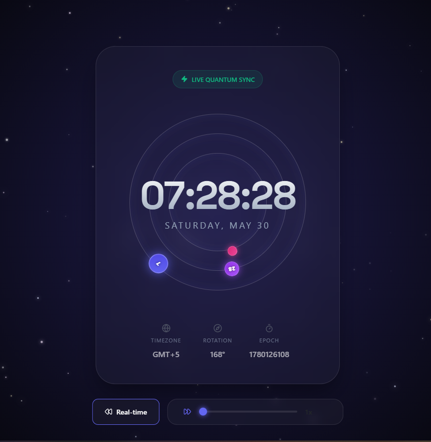

<div align="center">

# 🌌 Chronos Nebula

### _The Future of Time — A Celestial Clock Experience_

A visually stunning, generative clock web application that reimagines timekeeping as a cosmic event. Hours, minutes, and seconds orbit a central display like celestial bodies traversing the void, all rendered against a procedurally generated starfield.

[](https://react.dev/)
[](https://vite.dev/)
[](https://www.framer.com/motion/)
[](https://getbootstrap.com/)
[](LICENSE)

---



_Live quantum-synced celestial clock with orbital time visualization and time-warp controls._

</div>

---

## ✨ Features

| Feature | Description |
|---|---|
| 🪐 **Orbital Time System** | Hours, minutes, and seconds are represented as glowing planetary bodies orbiting concentric rings — each rotating in real-time to reflect the current time. |
| 🌠 **Generative Starfield** | A procedurally generated background with **450 stars**, including centralized core density, multi-color palettes, twinkling animations, and drifting celestial bodies. |
| ⚡ **Live Quantum Sync** | Real-time clock synchronization using `requestAnimationFrame` for silky-smooth, frame-perfect updates. |
| ⏩ **Time Warp Controls** | An interactive slider (1x–1000x) lets you accelerate time to watch the orbital system spin at hyperspeed — perfect for visualizing time passage. |
| 🎨 **Glassmorphism UI** | Frosted-glass panels with `backdrop-filter: blur()`, subtle neon glow borders, and layered transparency for a premium, modern aesthetic. |
| 📊 **Live Telemetry Panel** | Displays real-time metadata — **Timezone**, **Rotation Degree**, and **Unix Epoch** — with hover-reveal animations. |
| 📱 **Responsive Design** | Fully responsive layout with mobile breakpoints that scale the orbital system, typography, and controls for smaller viewports. |
| 🎬 **Smooth Animations** | Framer Motion powers entrance animations, spring/tween-based orbital transitions, and interactive hover effects throughout. |

---

## 🛠️ Tech Stack

| Layer | Technology |
|---|---|
| **Framework** | [React 19.2](https://react.dev/) with JSX |
| **Build Tool** | [Vite 7.2](https://vite.dev/) — lightning-fast HMR & bundling |
| **Animations** | [Framer Motion 12](https://www.framer.com/motion/) — declarative motion |
| **Icons** | [Lucide React](https://lucide.dev/) — clean, consistent icon library |
| **Styling** | Vanilla CSS with CSS custom properties & glassmorphism |
| **Typography** | [Inter](https://fonts.google.com/specimen/Inter) + [Space Grotesk](https://fonts.google.com/specimen/Space+Grotesk) via Google Fonts |
| **CSS Framework** | [Bootstrap 5.3](https://getbootstrap.com/) — utility layer |
| **Linting** | ESLint 9 with React Hooks & Refresh plugins |

---

## 📁 Project Structure

```
Clock-React-Project/
├── public/
│   └── vite.svg                    # App favicon
├── src/
│   ├── assets/
│   │   └── react.svg               # React logo asset
│   ├── components/
│   │   ├── Background.jsx          # Generative starfield with 450 procedural stars
│   │   └── CelestialClock.jsx      # Core clock — orbital system, display, and warp controls
│   ├── App.jsx                     # Root component — composes Background + CelestialClock
│   ├── App.css                     # Complete design system — themes, animations, layout
│   └── main.jsx                    # React 19 entry point with StrictMode
├── index.html                      # HTML shell with Google Fonts & SEO meta tags
├── vite.config.js                  # Vite configuration with React plugin
├── eslint.config.js                # ESLint flat config for React
├── package.json                    # Dependencies and scripts
└── README.md
```

---

## 🚀 Getting Started

### Prerequisites

- **Node.js** ≥ 18.x
- **npm** ≥ 9.x (or yarn / pnpm)

### Installation

```bash
# Clone the repository
git clone https://github.com/<your-username>/Clock-React-Project.git
cd Clock-React-Project

# Install dependencies
npm install

# Start the development server
npm run dev
```

The app will launch at **`http://localhost:5173`** with hot module replacement enabled.

### Available Scripts

| Command | Description |
|---|---|
| `npm run dev` | Start the Vite dev server with HMR |
| `npm run build` | Create an optimized production build |
| `npm run preview` | Preview the production build locally |
| `npm run lint` | Run ESLint on all source files |

---

## 🎮 How It Works

### Orbital Mechanics

The clock maps time to angular rotation on three concentric orbital rings:

```
Hours   → 360° / 12 = 30° per hour   (+ 0.5° per minute for smooth sweep)
Minutes → 360° / 60 = 6° per minute
Seconds → 360° / 60 = 6° per second
```

Each "planet" orbits its ring using Framer Motion's `animate` prop, with **tween** transitions for real-time mode and **spring** physics during time-warp for a natural feel.

### Time Warp Engine

The time-warp system uses `requestAnimationFrame` to advance time at a configurable multiplier:

- **1x** — Real-time mode, synced to `new Date()`
- **2x–1000x** — Simulated acceleration, advancing the internal clock by `(1000/60) × multiplier` ms per frame

### Generative Starfield

The `Background` component procedurally generates 450 stars on mount using `useState` with a lazy initializer to avoid re-computation. Stars feature:

- **Core density bias** — Stars indexed 250+ cluster near the center (40–60% viewport range)
- **Multi-color palette** — White, indigo, amber, pink, and silver tones
- **CSS-driven animations** — `twinkle` (opacity + scale) and `drift` (positional movement) with randomized delays and durations

---

## 🎨 Design System

The app uses a carefully crafted CSS custom property system:

```css
--bg-deep: #050508          /* Deep space background */
--accent-primary: #6366f1   /* Indigo — hours planet, UI accents */
--accent-secondary: #a855f7 /* Purple — minutes planet */
--glass-bg: rgba(255, 255, 255, 0.03)   /* Glassmorphism fill */
--glass-border: rgba(255, 255, 255, 0.1) /* Frosted border */
--neon-glow: 0 0 20px rgba(99, 102, 241, 0.3) /* Neon glow effect */
```

The planetary color coding provides intuitive visual hierarchy:
- 🔵 **Hours** — Indigo gradient (`#6366f1` → `#4f46e5`)
- 🟣 **Minutes** — Purple gradient (`#a855f7` → `#9333ea`)
- 🔴 **Seconds** — Pink gradient (`#ec4899` → `#db2777`)

---

## 📄 License

This project is open source and available under the [MIT License](LICENSE).

---

<div align="center">

**Built with ⚛️ React & ✨ Creativity**

</div>
